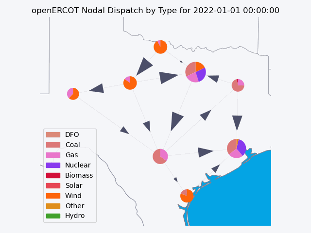

<a name="readme-top"></a>

# openERCOT


Open source power modeling and grid analysis.



--- 

## Getting Started

openERCOT is a powerful grid simulation toolkit that has been used to simulate the ERCOT grid.

### Prerequisites

There is only one prerequisite to be able to use openERCOT and it will handle the rest for you.
* Nix - this powerful package manager can be installed using the [Determinate Systems Nix Installer](https://github.com/DeterminateSystems/nix-installer).

    ```sh
    curl --proto '=https' --tlsv1.2 -sSf -L https://install.determinate.systems/nix | sh -s -- install
    ```

### Installation

1. Get an API Key for [https://www.eia.gov/opendata/](https://www.eia.gov/opendata/) and an API Key for [https://api.data.gov/](https://api.data.gov/)
2. Clone the repo
   ```sh
   git clone https://github.com/A1029384756/openERCOT.git
   ```
3. Enter Nix development shell
   ```sh
   nix develop
   ```
4. Enter your API keys in `.env` at the root of the project
   ```js
   EIA_API_KEY = 'ENTER YOUR API';
   CEMS_API_KEY = 'ENTER YOUR API';
   ```


## Usage

1. Enter your nix development shell
    ```sh
    nix develop
    ```
2. Create a custom scenario to simulate
    ```toml
    [simulation_params]
    start_date = "2022-01-01"
    end_date = "2023-01-01"
    committable = false
    set_size = 672
    overlap = 24
    
    [io_params]
    network_path = "network.nc"
    graphs_to_file = true
    ```

3. Simulate the network
    ```sh
    python ./main.py --scenario <path_to_scenario.toml>
    ```

See the [open issues](https://github.com/othneildrew/Best-README-Template/issues) for a full list of proposed features (and known issues).

## License

Distributed under the GPLv3 License. See `license.txt` for more information.
